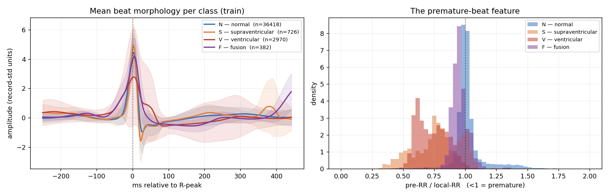

# Data Card — MIT-BIH, patient-disjoint build

Built by `src/build_dataset.py` from raw PhysioNet `mitdb` records. **Not** the Kaggle CSVs — see `ECG_Project_Plan_v3.md` for why.

## What each example is

| | |
|---|---|
| Waveform | **250 floats** — a fixed window `[R−90, R+160)` at 360 Hz = −0.25 s to +0.44 s around the R-peak |
| R-R features | **4 floats** — `pre_rr`, `post_rr`, `local_rr` (10-beat mean), `pre_rr/local_rr`; all normalised by record mean R-R |
| Label | one of **N / S / V / F** |
| Provenance | `record_id` retained for every beat |

Preprocessing: lead **MLII selected by name** (record 114 has it on channel 1); signal divided by per-record std; per-beat median subtracted for baseline removal. No resampling, no zero padding.

**Input dimension: 254.** Baseline architecture `[254, 64, 32, 4]`.

## Splits — patient-disjoint by construction

| split | records | N | S | V | F | total | majority baseline |
|---|---|---|---|---|---|---|---|
| train | 17 | 36,418 | 726 | 2,970 | 382 | 40,496 | 89.9% |
| dev | 5 | 9,430 | 218 | 818 | 32 | 10,498 | 89.8% |
| test | 22 | 44,240 | 1,837 | 3,220 | 388 | 49,685 | 89.0% |

Class proportions (%):

| split | N | S | V | F |
|---|---|---|---|---|
| train | 89.93 | 1.79 | 7.33 | 0.94 |
| dev | 89.83 | 2.08 | 7.79 | 0.30 |
| test | 89.04 | **3.70** | 6.48 | 0.78 |

- **test = DS2**, the standard de Chazal inter-patient test set. train+dev = DS1.
- Paced records `102, 104, 107, 217` excluded. Records 102 and 104 have no MLII lead at all.
- Class **Q dropped** — only ~15 beats survive outside the paced records.
- Assertion enforced in the build: the three record sets are pairwise disjoint.

**Beat accounting:** 109,494 annotated beats → 105,039 extracted (39 edge beats whose window ran off the signal; ~4,400 in records 102/104 with no MLII) → 101,144 after dropping Q → 100,679 across the three splits after removing the two remaining excluded paced records.

## Two properties to carry into later phases

### 1. Class S nearly doubles between train and test — 1.79% → 3.70%

Not an error. It is baked into the de Chazal benchmark, and it is a **genuine train/test distribution shift** available for free. Phase 4's mismatch analysis has real material rather than a contrived setup.

### 2. Dev-set F metrics are unreliable — 32 beats

**Record 208 alone holds 372 of DS1's 414 F beats (90%); 12 of 22 DS1 records have zero F.** So the choice was binary: 208 in train and dev gets ≤42 F beats, or 208 in dev and the model has ~42 F beats to learn from. The best any 5-record dev pick achieves is ~36.

Decision: **208 stays in train.** Training signal for F matters more than a precise dev estimate.

Consequence: with 32 dev F beats, one misclassification moves F recall by ~3 points. **Trust the test set (388 F beats) for F; treat dev-F as directional only.** This belongs in the strategy memo — it is exactly C3's "is my dev set big enough" question, arising naturally.

## Verification



**R-peak alignment** — the mean waveform peaks within 3–6 ms of t=0 for every class, confirming segmentation is aligned:

| class | amplitude at R | max | at | min |
|---|---|---|---|---|
| N | +4.38 | +4.45 | +3 ms | −0.97 |
| S | +4.66 | +4.94 | +3 ms | −1.58 |
| V | +2.74 | +2.79 | +3 ms | −0.56 |
| F | +3.93 | +4.20 | +6 ms | −0.55 |

**Morphology is medically plausible** (left panel): V shows the classic low, wide QRS with a deep negative deflection immediately after — clearly separable from N by shape alone. F sits *between* N and V, which is what a fusion beat is. **S is nearly identical in shape to N**, with only the early arrival of the following beat visible around +380 ms — the structural reason a shape-only model cannot find class S.

**The R-R features work as predicted** (right panel). Median `pre_rr/local_rr`:

| N | S | V | F |
|---|---|---|---|
| 1.002 | **0.784** | 0.720 | 0.951 |

N sits at 1.0; S and V are clearly premature. This is the feature that should move S recall in the Phase 3 ablation.

## Loading

```python
import numpy as np
X   = np.load("data/build/train_X.npy")    # (40496, 250) float32
rr  = np.load("data/build/train_rr.npy")   # (40496, 4)   float32
y   = np.load("data/build/train_y.npy")    # (40496,)     int64, 0=N 1=S 2=V 3=F
rec = np.load("data/build/train_rec.npy")  # (40496,)     record id per beat
```

Same for `dev_` and `test_`. Class order and record membership are in `data/build/splits.json`.
