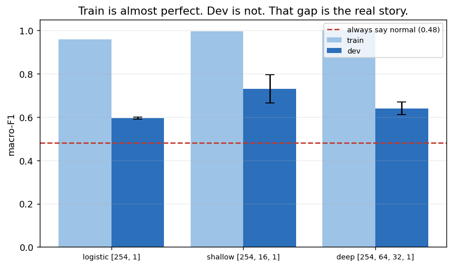
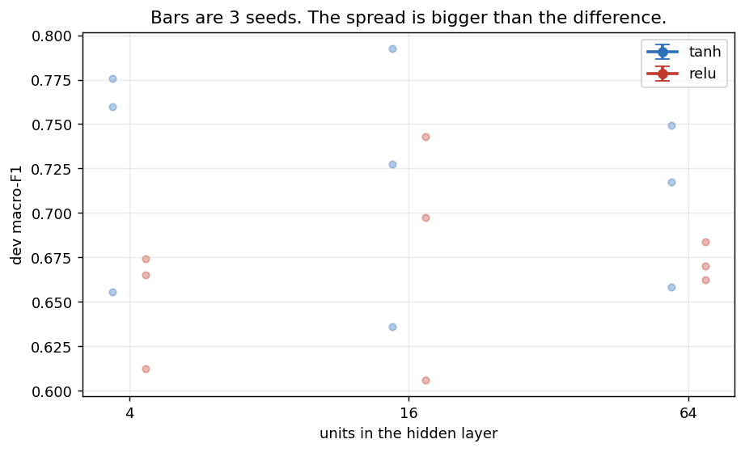

# Phase 2 — C1 mechanics, binary N vs. V

Logistic regression → one hidden layer → deep network, all written from scratch in NumPy.
Ties to C1W2–W4. 24 runs logged in `results/results.csv`.

**Task:** two classes only — N (normal) vs. V (ventricular). 39,388 train beats
(36,418 N / 2,970 V), 10,248 dev beats, patient-disjoint.

**The floor:** always predicting N gives **accuracy 0.9246, macro-F1 0.4804**.
Macro-F1 is the number that matters; accuracy is not usable at a 92% majority.

---

## Gates

All four passed before any result was interpreted.

| gate | requirement | result |
|---|---|---|
| Scratch LR vs. `sklearn` | train accuracy within 1% | **0.0023** — models agree on 99.34% of beats |
| `model.py [254,1]` vs. `logistic.py` | reproduce to ~1e-6 | **0.000e+00** — bit-identical, and still identical after 20 descent steps |
| Gradient check | relative error < 1e-7 | **1.8e-09 to 7.0e-09** across `[8,1]`, `[8,5,1]`, `[8,5,4,1]`, and with L2 on |
| Gradient check catches a real bug | a deliberate 1% error in `dW1` must fail | **3.9e-03** — four orders of magnitude above threshold |

The last one matters as much as the third. A check that always passes proves nothing;
this one demonstrably has teeth.

For the sklearn comparison, `penalty=None` was required — sklearn regularises by
default (`C=1.0`), which would have made it a different problem.

---

## Results

### The three models

All tanh, He init, plain gradient descent, batch 64, 30 epochs, 3 seeds each.

| model | train mF1 | dev mF1 | std | dev acc |
|---|---|---|---|---|
| 1. logistic `[254, 1]` | 0.958 | 0.596 | **0.005** | 0.878 |
| 2. shallow `[254, 16, 1]` | 0.997 | **0.731** | 0.065 | 0.846 |
| 3. deep `[254, 64, 32, 1]` | **0.9996** | 0.640 | 0.029 | 0.799 |



### The shallow sweep — 3 sizes × 2 activations × 3 seeds

| hidden | activation | mean dev mF1 | std | min | max |
|---|---|---|---|---|---|
| 16 | tanh | **0.731** | 0.065 | 0.656 | 0.776 |
| 4 | tanh | 0.719 | 0.078 | 0.636 | 0.792 |
| 64 | tanh | 0.708 | 0.046 | 0.658 | 0.749 |
| 4 | relu | 0.682 | 0.070 | 0.606 | 0.743 |
| 64 | relu | 0.672 | 0.011 | 0.662 | 0.684 |
| 16 | relu | 0.651 | 0.033 | 0.613 | 0.674 |



---

## What the numbers say

### 1. Depth did not help — it hurt

The order is shallow > deep > logistic. That is not the expected story, and the train
column explains it: the deep network reaches **0.9996 train macro-F1**. It has
essentially memorised the training set and generalises *worse* than a 16-unit network.

The constraint is not model capacity. 40,496 training beats come from **17 patients**,
and no architecture can invent an eighteenth. Every configuration tried sits at
0.96–0.9996 on train, so all of them are already large enough.

This is the clearest possible argument for the patient-disjoint split. On a
beat-shuffled split, all three models would score ~0.99 on both train and dev, the
ranking would be meaningless, and there would be nothing to diagnose.

### 2. Seed noise is larger than the effect of most settings

Hidden=4 with tanh spans **0.636 to 0.792 across three seeds** — a 0.16 swing from
nothing but the random starting weights. That is wider than the gap between the best
and worst configuration in the sweep.

Running one seed per setting would have produced a confident, arbitrary conclusion.
The three-seed rule earned its keep on the first sweep.

Two effects do survive the noise:

- **tanh beats relu at every size**, by roughly 0.05, consistently.
- **Hidden size barely matters** — 4 units perform about as well as 64.

### 3. Logistic regression is stable because it is convex

Logistic regression has a seed std of **0.005**; the networks range from 0.029 to
0.065. A convex problem has one optimum, so initialisation cannot change where it
lands. A network has many, and the seed decides which basin it falls into.

This is why the three-seed rule is specifically a *network* discipline.

### 4. Accuracy would have pointed the wrong way

The trained logistic regression scores **dev accuracy 0.878** — below the 0.920 floor
— while raising macro-F1 from 0.480 to 0.596. It finds some V beats and pays for them
with false alarms on normal ones. Judged on accuracy, every model here looks worse
than doing nothing.

The deep network is starker still: dev accuracy 0.799, macro-F1 0.640.

---

## Bias / variance (preview for Phase 5)

Every model sits in the same regime: **train ≈ 0.96–0.9996, dev ≈ 0.60–0.73.**
Near-zero bias, very high variance. The standard remedies are more data or
regularisation — and "more data" here means *more patients*, not more beats.

Phase 4 tests whether regularisation closes any of the gap. Based on this, the honest
expectation is: some, not much.

---

## Files

```
src/ecg/init.py          zeros | random | xavier | he
src/ecg/activations.py   relu | tanh | sigmoid | softmax + derivatives
src/ecg/losses.py        binary cross-entropy, L2, class weights, dZL
src/ecg/logistic.py      standalone C1W2 logistic regression
src/ecg/model.py         L-layer forward / backward, dropout wired
src/ecg/gradcheck.py     numerical gradient verification
src/ecg/train.py         train(config) -> one row in results.csv

notebooks/02_logistic_regression.ipynb
notebooks/03_shallow_nn.ipynb
notebooks/04_deep_nn_gradcheck.ipynb
scripts/make_phase2_notebooks.py
```

**Not implemented, by design:** categorical cross-entropy (Phase 3), momentum /
RMSprop / Adam and LR decay (Phase 4), batch norm (Phase 4). Each raises
`NotImplementedError` naming its phase.

**Test set:** untouched. Read once, in Phase 5.
