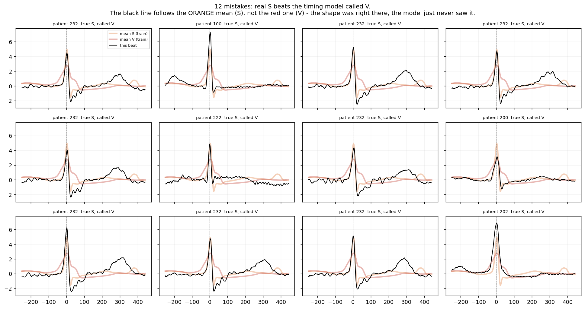

# Strategy memo — ECG arrhythmia classification

*Phase 5. Ties to C3W1–W2. Written after the test set was read, once.*

---

## Summary

The model selected on the dev set turned out to be **the worst of three candidates on
the test set**. This memo is mostly about why, because the reason is specific,
measurable, and more useful than the score.

| model | dev macro-F1 | **test macro-F1** | change |
|---|---|---|---|
| timing only (4 features) — *selected* | 0.5572 ± 0.003 | **0.4193** ± 0.002 | **−0.138** |
| shape + timing (254 features) | 0.3861 ± 0.028 | **0.4794** ± 0.032 | +0.093 |
| shape only (250 features) | 0.3232 ± 0.031 | 0.4040 ± 0.015 | +0.081 |

Test floor (always predict N): accuracy 0.8904, macro-F1 0.2355.

**The selected model is kept.** Switching to the 254-feature model now would be
selecting on the test set, which would destroy the only unbiased estimate in the
project. The 0.4193 stands as the reported result.

---

## 1. Choice of metric

**Macro-F1**, not accuracy. The evidence, on test:

| | accuracy | macro-F1 |
|---|---|---|
| always predict N | 0.8904 | 0.2355 |
| selected model | 0.9205 | 0.4193 |

Accuracy moves 3 points and suggests a marginal model. Macro-F1 nearly doubles. With
89% of beats normal, accuracy is dominated by the majority class and is close to
useless for ranking models here.

One consequence worth stating, because it is easy to get wrong: **macro-F1 ignores
class sizes.** The well-known S shift between splits (1.79% of train, 3.70% of test)
therefore explains *none* of the drop. If per-class F1 had held, macro-F1 would have
stayed at 0.5608 whatever the mix. The per-class scores themselves fell.

---

## 2. Bias and variance

| model | train | dev | test | train−dev |
|---|---|---|---|---|
| timing only (4) | 0.5634 | 0.5572 | 0.4193 | **0.006** |
| shape + timing (254) | 0.9567 | 0.3861 | 0.4794 | **0.571** |
| shape only (250) | 0.9310 | 0.3232 | 0.4040 | 0.608 |

The two candidates sit at **opposite ends of the trade-off**:

- **Timing-only is high bias, near-zero variance.** Train and dev agree to 0.006, but
  it reaches only 0.5634 *on data it was trained on*. Four numbers cannot express the
  problem. More data, more regularisation and better optimisation would all be wasted
  — the standard remedy is a richer model or richer features.
- **The 254-feature models are low bias, enormous variance.** They reach 0.93–0.96 on
  train and lose 0.57–0.61 by dev. They fit 17 patients almost perfectly and do not
  transfer. The standard remedy is more data — and here that means **more patients**,
  not more beats.

Phase 4 spent 174 runs tuning regularisation and optimisation. In hindsight it was
optimising the high-bias model, where none of those levers apply. That is visible in
the results: no C2 technique moved the score more than ~0.05.

---

## 3. Error analysis

Of 3,949 test errors:

| error | count | share |
|---|---|---|
| **S called V** | 1,197 | 30.3% |
| N called V | 914 | 23.1% |
| S called N | 579 | 14.7% |
| V called N | 463 | 11.7% |
| F called N | 385 | 9.7% |
| others | 411 | 10.4% |

Per-class F1, dev → test:

```
N: 0.9737 -> 0.9702  (-0.004)
S: 0.6280 -> 0.0535  (-0.575)   <- the entire collapse
V: 0.6413 -> 0.6647  (+0.023)
F: 0.0000 -> 0.0000
```

**The whole drop is class S.** Of 1,837 true S beats on test, 65.2% were called V and
31.5% N; only 3.3% were correct.

### Root cause

The timing features detect **prematurity**. But *both* S and V beats are premature.
Timing says "this beat arrived early"; it cannot say which kind of early beat it is.
Separating them requires **shape**, which this model does not have.

Measured directly — separability of S from V using `pre_rr/local_rr` alone:

| split | S median | V median | **AUC** | n_S |
|---|---|---|---|---|
| train | 0.784 | 0.720 | 0.595 | 726 |
| **dev** | 0.950 | 0.779 | **0.668** | 218 |
| **test** | 0.727 | 0.726 | **0.514** | 1,837 |

**On test the feature is barely better than a coin flip (0.514).** On dev it looked
usable.

And the visual check confirms the shape was there:



**94.6% of the 1,197 misclassified S beats are closer in shape to the average S beat
than to the average V beat** (mean distance 10.40 vs 15.13). Every black trace in the
figure has the narrow, sharp QRS of a supraventricular beat, not the wide rounded form
of a ventricular one. The information needed was present in the signal and discarded
by the feature choice.

---

## 4. Why the dev set misled us

This is the central lesson, and it is **not** "the dev set was too small".

Dev's 218 S beats come from five patients — but effectively two:

```
207: 107 S beats, median ratio 0.992      <- S beats arrive essentially ON TIME
223:  73 S beats, median ratio 0.819
124:  31 S beats, median ratio 0.986
205:   3      108:   4
```

Test's S beats come from sixteen patients, dominated by a very different one:

```
232: 1382 S beats, median ratio 0.738     <- indistinguishable from V (0.726)
222:  209 S beats, median ratio 0.613
202:   55 S beats, median ratio 0.558
```

The model learned a rule that was true of **two hearts** — *"S beats are only slightly
early; V beats are very early"* — and dev could not contradict it, because dev *was*
those two hearts.

> **A dev set needs enough patients per class, not enough beats per class.**

218 S beats sounds adequate. Two S patients is not. This was foreseeable: the data
card recorded in Phase 0 that F was concentrated in one patient and flagged dev-F as
unreliable. The same reasoning applied to S and was not carried through — the dev
split was chosen with a constraint on *beat* counts per class (≥30), when the
constraint should have been on *patient* counts per class.

**Concrete fix for a future version:** require every class to appear in at least 3–4
dev patients, or replace the fixed split with patient-wise cross-validation over all
22 DS1 patients. Phase 4a's plan already flagged CV as the escalation path if dev
looked noisy. Dev was not noisy — it was *consistently wrong*, which is harder to
notice and exactly what rotation would have exposed.

---

## 5. Per-patient results

Pooled numbers hide the spread. Macro-F1 per test patient:

```
min 0.263   median 0.528   max 1.000
worst: 219 (0.263), 232 (0.312), 213 (0.320), 202 (0.320), 100 (0.352)
best : 113 (0.896), 212 (1.000), 105 (1.000)
```

A 4× spread across hearts. Patients 212 and 105 score 1.000 because they are almost
entirely normal beats — the model is not solving anything there. Patient 232, holding
75% of all test S beats, scores 0.312.

For a clinical claim, the per-patient distribution matters far more than the pooled
figure, and the worst case matters more than the median.

---

## 6. Limitations

- **Class F is not learnable from this data.** F1 = 0.000 on dev and test, across 189
  four-class runs. 382 training beats, 372 of them from patient 208. This is a
  property of MIT-BIH, not of the model. It should be reported, not chased.
- **44 usable patients**, 17 for training. Patient diversity, not beat count, is the
  binding constraint on everything here.
- **One lead (MLII), one database, one annotation protocol.** No claim beyond it.
- **A fully-connected network on 250 raw samples is a weak representation of a
  waveform.** It has no notion that neighbouring samples are related and must learn
  shape independently at every offset, from 17 patients. This is why the literature
  uses convolutional networks on this dataset, and it is the measured cost of the
  project's decision to exclude them.
- **The reported 0.4193 is a genuinely held-out number**, but it comes from a model
  chosen by a flawed procedure. The honest reading is: *this is what the selected
  model achieves*, not *this is the best achievable here*.

---

## 7. What I would do next, in order

1. **Fix the dev split first** — patients per class, or patient-wise cross-validation.
   Every downstream decision inherits this.
2. **Re-run model selection** under that split. The 254-feature model would likely be
   chosen, and its ranking would then mean something.
3. **Attack the variance**, not the optimiser. More patients (svdb adds 78 records and
   4.4× the S beats) is the direct remedy.
4. **Then consider a 1D CNN.** The error analysis shows the discriminating information
   is in the beat shape and that a flat network cannot use it. That is an
   architecture problem, and it is the natural bridge to Course 4.

---

*Test set read once, in `scripts/run_phase5_test.py`. No model, feature, or
hyper-parameter decision was made after reading it.*
